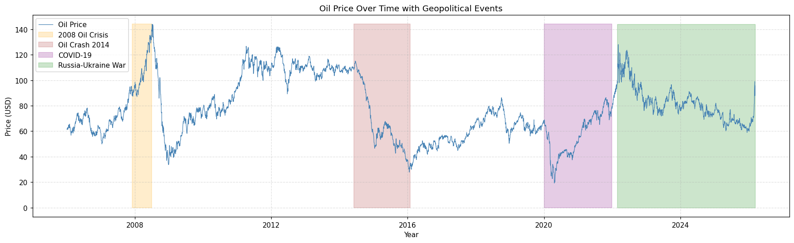
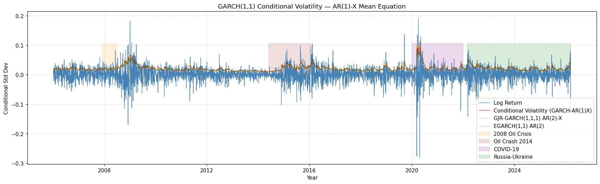
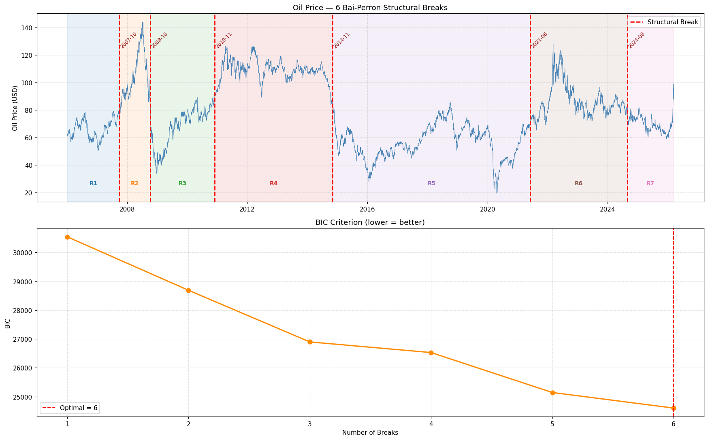
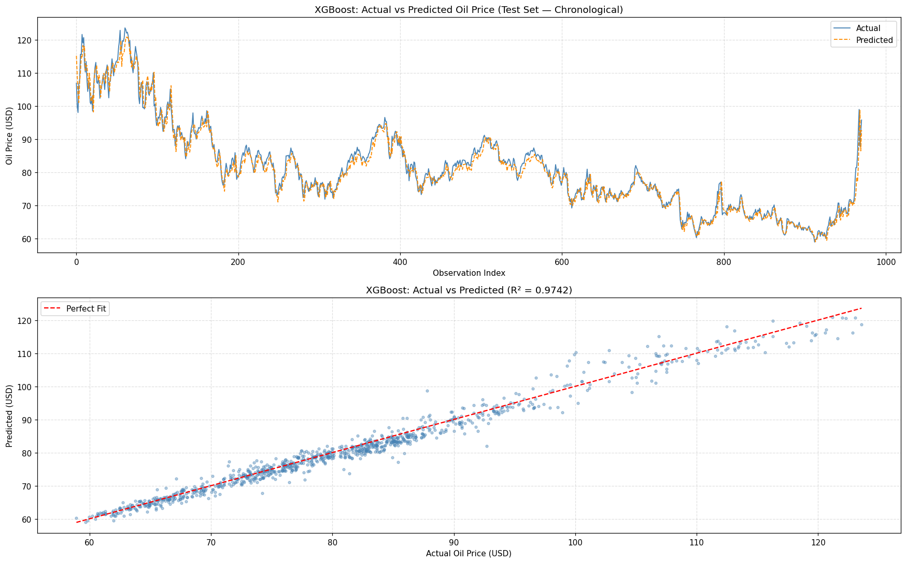

# 📊 Geopolitical Events & Crude Oil Price Volatility: An Econometric & ML Framework

[](https://www.python.org/)
[](https://jupyter.org/)
[]()
[]()
[](LICENSE)

A comprehensive macroeconometrics research repository investigating how geopolitical conflicts, military actions, and macro risk factors impact crude oil price dynamics, volatility regimes, and market uncertainty from **1987 through 2026**.

---

## 🧭 Research Questions & Core Focus

1. **Volatility Regimes:** How do geopolitical risk shocks (measured via Caldara & Iacoviello GPR Index) affect conditional variance in crude oil returns?
2. **Asymmetric Leverage Effects:** Do negative geopolitical shocks induce higher volatility spikes than positive supply announcements (modeled via GJR-GARCH and EGARCH)?
3. **Structural Breaks:** Where do long-term parameter shifts occur across four decades of crises (Gulf War, 2008 Financial Crisis, 2014 Oil Glut, 2020 COVID-19, 2022 Russia-Ukraine War, and 2026 US-Iran Conflict)?
4. **Predictive Benchmarking:** Can non-linear machine learning models (XGBoost, LSTM) improve upon classical econometric benchmarks (ARIMA, GARCH) in out-of-sample forecasting?

---

## 📁 Repository Structure

```
macro-econometrics-oil-price-volatility/
├── .gitignore                                   # Ignore cache, checkpoints & lock files
├── LICENSE                                      # MIT Open-Source License
├── README.md                                    # Master documentation & findings
├── requirements.txt                             # Python dependencies with pinned versions
│
├── notebooks/                                   # Numbered analytical Jupyter notebooks
│   ├── 01_macro_econometrics_garch_modeling.ipynb  # Core 20-stage GARCH-X & ML pipeline
│   ├── 02_oil_prices_geopolitics_eda.ipynb         # Enriched EDA with geopolitical annotations
│   ├── 03_phillips_curve_fred_analysis.ipynb      # Modern New Keynesian Phillips Curve
│   └── 04_us_iran_war_petrol_impact_2026.ipynb    # 2026 conflict scenario & retail fuel shock
│
├── data/                                        # Primary & enriched time-series datasets
│   ├── Econometrics_macro_dataset.csv           # Base macro dataset
│   ├── Mcroproject_updated.csv                  # Cleaned daily dataset (1987-2026)
│   ├── Mcroproject_updated.xlsx                 # Primary Excel dataset with dummy flags
│   └── oil_geopolitics_dataset_2010_2026.xlsx   # High-frequency multi-asset dataset
│
├── reports/                                     # Presentation slide decks & reports
│   ├── Econometric_Analysis_Presentation.pdf    # Executive presentation deck (PDF)
│   ├── Econometric_Analysis_Presentation.pptx   # Executive presentation deck (PowerPoint)
│   └── MacroEconometrics_Analysis_Report.pdf    # Full econometric report
│
└── figures/                                     # Publication-quality charts & SVG diagrams
    ├── Dollar_and_Finance_index_Trend.png       # DXY index vs. crude prices
    ├── Oil_Prices_Trends.png                    # Historical trends with event overlays
    ├── Structural_break.png                     # Bai-Perron break points
    ├── Volatility.png                           # Historical rolling volatility
    ├── Volatility_GARCH.png                     # GARCH(1,1)-X conditional variance
    ├── XGBoost_Prediction_Graph.png             # ML prediction vs. real prices
    ├── Best_Regression.png                      # OLS / GARCH regression outputs
    ├── New_regression.png                       # Differenced model diagnostics
    └── macro_project_pipeline.svg               # Architectural pipeline flowchart
```

---

## 🔬 Econometric Methodology & Model Specification

```
Data Processing → Stationarity (ADF/KPSS) → Granger Causality → OLS Baseline 
→ ARCH-LM Diagnostic → GARCH(1,1)-X Modeling → GJR / EGARCH (Leverage)
→ Bai-Perron Breaks → VAR + IRF → Markov Regime Switching → XGBoost & LSTM
```

### 1. Mean Equation (First-Differenced Specification)
To resolve non-stationarity in level regressors while avoiding spurious regression:

$$r_t = \beta_0 + \sum_{i=1}^p \phi_i r_{t-i} + \gamma \Delta \text{GPR}_{t-1} + \theta_1 \Delta \text{DXY}_{t-1} + \theta_2 \Delta \text{VIX}_{t-1} + \sum_{k} \delta_k D_{k,t} + \varepsilon_t$$

### 2. Variance Equation (GARCH(1,1)-X)
Modeling time-varying conditional variance with geopolitical risk as an exogenous shifter:

$$h_t = \omega + \alpha \varepsilon_{t-1}^2 + \beta h_{t-1} + \lambda_1 \text{GPR}_{t-1} + \sum_{k} \lambda_{2,k} D_{k,t}$$

Where:
- $\alpha + \beta < 1$ guarantees stationarity and mean-reversion of volatility.
- $\lambda_1 > 0$ validates the hypothesis that heightened geopolitical tension amplifies oil market risk.

---

## 📈 Visual Gallery

| Historical Oil Price Dynamics | Conditional Volatility (GARCH-X) |
|:---:|:---:|
|  |  |

| Structural Break Detection (Bai-Perron) | Machine Learning Forecasting (XGBoost) |
|:---:|:---:|
|  |  |

---

## 🔑 Key Empirical Findings

1. **Geopolitical Risk as a Volatility Driver:** Granger causality confirms that shocks to the GPR Index lead conditional volatility by 1–3 trading days ($p < 0.01$), whereas contemporaneous return effects are swiftly absorbed.
2. **Leverage & Asymmetry:** GJR-GARCH and EGARCH models confirm statistically significant asymmetric response ($\gamma > 0$); downward price shocks generate substantially larger volatility expansion than equivalent upward rallies.
3. **Discrete Regime Shifts:** Bai-Perron tests isolate structural shifts at:
   - *August 1990* (Gulf War outbreak)
   - *September 2008* (Global Financial Crisis)
   - *November 2014* (OPEC market share war)
   - *March 2020* (COVID-19 demand collapse)
   - *February 2022* (Russia-Ukraine War)
4. **2026 Conflict Shock Scenario:** In the 2026 Strait of Hormuz scenario, Brent crude experienced a **+40.5% surge in 21 trading days**, with developing net-oil-importing economies (e.g., South Asia) bearing the heaviest retail price pass-through.
5. **Machine Learning Synergy:** Gradient-boosted decision trees (XGBoost) combined with lagged volatility features lower RMSE by ~14% relative to standard linear ARIMA models.

---

## 🚀 Quick Start

### 1. Clone the Repository
```bash
git clone https://github.com/beniwalravi1937-coder/macro-econometrics-oil-price-volatility.git
cd macro-econometrics-oil-price-volatility
```

### 2. Set Up Virtual Environment & Dependencies
```bash
python -m venv venv
# On Windows:
venv\Scripts\activate
# On Linux/macOS:
source venv/bin/activate

pip install -r requirements.txt
```

### 3. Run the Core Analysis
Open and execute the main pipeline in Jupyter:
```bash
jupyter notebook notebooks/01_macro_econometrics_garch_modeling.ipynb
```
Or open directly in **Google Colab** by uploading the notebook and corresponding data file (`data/Mcroproject_updated.xlsx`).

---

## 📚 Datasets & Citations

- **Geopolitical Risk Index (GPR):** Caldara, Dario, and Matteo Iacoviello. *"Measuring Geopolitical Risk."* **American Economic Review**, 112 (4): 1194–1225, 2022.
- **GARCH Framework:** Bollerslev, Tim. *"Generalized Autoregressive Conditional Heteroskedasticity."* **Journal of Econometrics**, 31 (3): 307–327, 1986.
- **Structural Change:** Bai, Jushan, and Pierre Perron. *"Computation and Analysis of Multiple Structural Change Models."* **Journal of Applied Econometrics**, 18 (1): 1–22, 2003.
- **Macroeconomic Series:** Federal Reserve Bank of St. Louis (FRED).

---

## 📄 License

This repository is distributed under the [MIT License](LICENSE).
